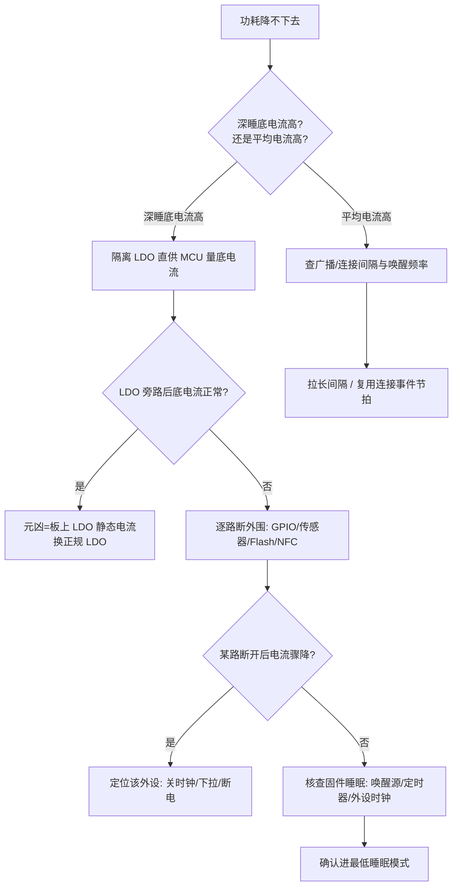

# KeyGo 调试踩坑记录

> 分类：硬件与半导体 / 汽车电子  
> 项目类型：实战项目（基于 CH582M 的 BLE 智能车钥匙）  
> 关联主文：[KeyGo：BLE 手机钥匙](KeyGo-BLE手机钥匙.md)  
> 关联综述：[无钥匙进入系统](无钥匙进入系统.md)  
> 更新日期：{{ git_revision_date_localized }}

---

本页沉淀 KeyGo 开发过程中**真实的调试经历与坑位**，与 [KeyGo：BLE 手机钥匙](KeyGo-BLE手机钥匙.md) 的"成品总结"互补：主文写"最终怎么做"，本页写"中途怎么栽、怎么爬出来"。每条踩坑尽量保留**现象 → 排查路径 → 根因 → 解法 → 方法论**的完整链路，方便日后回看或迁移到其他项目。

---

## 1. LDO 暗电流淹没了低功耗（血泪 4 天）

### 1.1 现象

KeyGo 实体钥匙端（CH582M）是电池供电，**深睡电流**是续航的第一指标。开发阶段出现：

- 无论如何改固件，**深睡电流都降不下去**，始终远高于 CH582M 标称的 µA 级下限。
- 解锁手感、射频都正常，唯独"待机功耗"这条指标死活不达标。
- 直觉判断：**"是不是代码没睡好？"** —— 这是最自然的归因，也是整段弯路的开端。

### 1.2 排查路径（时间线）

| 阶段 | 怀疑对象 | 动作 | 结果 |
|------|----------|------|------|
| 第 1–2 天 | 固件睡眠配置 | 核对 / 加固睡眠流程，关未用外设时钟、降频、清唤醒源 | 电流几乎不动，没有任何改善 |
| 第 3 天 | 某个外设没关干净 | 逐模块注释外设初始化，怀疑 GPIO 漏电、ADC 参考没关 | 仍无改善，开始怀疑"是不是芯片本体功耗就这样" |
| 第 4 天 | 硬件 / 外围电路 | **换上淘宝买的原厂/第三方开发板对比测量** | 开发板电流明显小于自己的板子 → 锁定：**问题在硬件，不在代码** |

> 关键转折点是"换板对比"：同一套固件、同一块表，只是把 MCU 从"自己的板子"挪到"别人的开发板"，电流就下来了。这一步把"代码问题"彻底排除，把矛头指向**自己板子的外围电路**。

### 1.3 根因：XC6206 山寨料的静态电流

直觉里"代码没睡好"之所以骗了人，是因为**万用表量的是系统总电流**，分不清 MCU 和 LDO 各自的贡献。当 MCU 已经睡到 µA 级，而板上那颗 **XC6206 稳压器自身静态电流被山寨料拉到几百 µA ~ 1 mA** 时：

- LDO 的暗电流成了系统"底电流"的**绝对大头**；
- 无论 MCU 睡得多深，系统电流都被这颗 LDO 顶在高位，**代码再怎么优化都压不下去**；
- 于是出现"代码改了 4 天毫无效果"的荒诞局面。

> 这正好印证了 [KeyGo：BLE 手机钥匙](KeyGo-BLE手机钥匙.md#4-电源管理实战xc6206-山寨踩坑与-ldo-选型平替) 第 4 节的判断：山寨 XC6206 标称静态电流数 µA，实测可差到 300 倍。社区也有同款遭遇（见文末「参考」与第 2 节社区案例）。

### 1.4 解法

- **换用正规 LDO**：采购原厂/授权渠道的 XC6206P（或按主文第 4.2 节的平替表换 MCP1700 / ME6211 / RT9193 等超低 IQ 料），深睡底电流立刻回落到合理区间。
- **换板对比验证**：换料后再次用"自己的板 vs 开发板"同条件测电流，确认对齐。

### 1.5 方法论沉淀（可迁移）

!!! tip "低功耗压不下去时的排查顺序"
    1. **先量硬件基线，再怪代码**：拿最小系统 / 现成开发板跑同一固件，先确定"平台能做到多低"。代码优化永远有下限，而**外围 LDO/漏电**才是常见的隐藏天花板。
    2. **学会拆电流**：用"断开外围法"——逐路断开外设/电源，定位是哪颗料在偷电；不要只盯着 MCU 的总电流读数。
    3. **换板对比法**：当你坚信是代码时，先换一套已知良好的硬件跑同一份固件，能 30 秒排除一半可能性。
    4. **关键料留批次记录**：LDO、晶振、射频前端这类"看起来一样其实差别很大"的料，小批量也建议记渠道+批次，翻车时能快速复盘。

---

## 2. 社区案例印证：XC6206 的两类典型坑

下面两篇数码之家论坛帖子，与主文第 4 节和本文第 1 节形成互证，作为选型与调试时的外部参考。

### 2.1 山寨料静态电流差 300 倍（对应本文第 1 节）

有开发者用 XC6206P152MR 给石英钟锂电降压，**淘宝随便买的 10 只装**实测静态电流约 **1 mA**，而手册标称典型仅 **3 µA**——差了约 300 倍，导致锂电一个月就耗光。换天猫"原装"店的同型号后，静态电流回到 **4 µA** 左右。结论与本文完全一致：**山寨 XC6206 的静态电流才是低功耗的隐形杀手**，且差价仅约 3 分钱/片，"一分钱一分货"。

### 2.2 输出电容不当引发 LDO 自激（衍生坑，值得警觉）

另一篇帖子记录 XC6206 **上机莫名挂掉 / 电压波动**：分析指向 **LDO 自激**——根因是**输出电容的 ESR 与容量选择不当**（过大容量 + 过高 ESR 会诱发自激振荡）。表现虽不一定直接烧片，但会引起输出电压波动、PWM 电平抖动、LED 亮度不稳，长期使用可靠性崩坏。作者最终放弃 XC6206、改用大厂料（TI/ADI 等）。

!!! warning "给 KeyGo 的提醒"
    KeyGo 自己板子若沿用 XC6206，除了盯静态电流，**输入输出电容也要按原厂手册的 ESR/容量窗口选型**（常用 1 µF 低 ESR MLCC），避免踩进"自激"这一类的第二类坑。这类问题不会像第 1 节那样"电流降不下去"那么直观，却会表现为**偶发不稳、射频指标飘**，更难查。

---

## 3. 低功耗调试 Checklist（SOP）

可复用的"功耗降不下去"排障流程。核心思想：**先确定硬件平台能做到多低，再回头怪代码**——本文第 1 节 4 天的弯路，本质就是跳过了这一步。

### 3.1 测量准备：先保证"量得对"

- **仪器选择**
  - 粗测：高精度万用表 µA 档（看稳态平均值）。
  - 精测 / 看瞬态：**功耗仪**（Nordic PPK2、Joulescope 等）或"采样电阻 + 示波器"，能抓睡眠 µA 与广播/连接 mA 的跳变波形。普通万用表的平均值会把瞬态糊掉，容易误判。
- **接线要点**
  - 电流档 / 采样电阻必须**串在电源回路（VCC 支路）**，不能并在两端。
  - **隔离 LDO 自耗电**：直接用工稳电源喂 MCU 供电轨（跳过板上 LDO）单独量 MCU 系统，才能分清"是 MCU 没睡"还是"是 LDO 在偷电"（本文第 1 节的关键）。
  - 量程先大后小，避免 µA 档冲击烧表；上电瞬间电流大，注意限流。
- **先定基线**：明确"合格线"——深睡目标 µA 级、连接平均电流预期量级，否则没有判断标准。

### 3.2 排查顺序（核心 SOP）

| 步 | 动作 | 目的 / 判读 |
|----|------|-------------|
| 0 | 明确"降不下去"的**具体表现**：是深睡底电流高？还是平均电流高？ | 决定从哪一类查起 |
| 1 | **最小系统基线法**：拿开发板 / 只焊 MCU+最小外围，跑官方低功耗例程，确定平台能做到多低 | 排除"自己板硬件"这一整类 |
| 2 | **换板对比法**（本文第 1 节制胜招）：同一固件跑在已知良好硬件上电流正常 → 锁定自己板硬件 | 30 秒排除一半可能性 |
| 3 | **拆电流 / 断外围法**：逐路断外设电源、拉高/拉低 GPIO、断电传感器，找偷电点 | 定位具体元凶（见 3.3） |
| 4 | **固件睡眠核查**：确认真进最低睡眠（Halt/停机/关机），唤醒源唯一，定时器没偷偷跑，外设时钟关了 | 排除"代码没睡好" |
| 5 | **逐项收敛**：改一处、测一处、留记录，不一次改多变量 | 避免越改越乱 |

### 3.3 断外围法顺序图

### 3.4 CH582 低功耗实测参考点（社区数据）

CSDN 上一篇 CH582 触摸低功耗实测（BleTouchKey Demo）：注释掉 `tmos_set_event(TouchKey_TaskID, NOTIFY_DATA_EVT)`（关触摸上报）并屏蔽打印 log 后，测得 **唤醒态约 6 mA、睡眠态约 18 µA**。

- 这个 18 µA 是**某 Demo 含触摸模块**的实测值，不是 CH582 物理下限；纯 Halt 睡眠在关净外设后可更低（CH582 资料标称睡眠 < 1 µA，但前提是外设/时钟全关）。
- 对 KeyGo 的用法：把 6 mA / 18 µA 当作**量级参考锚点**——若你的板子睡眠态远高于 18 µA，优先走 3.2 的 SOP 而非继续微调配比。

### 3.5 常见"假低功耗"陷阱清单

- **LDO 静态电流**（本文第 1 节，最隐蔽）：山寨 XC6206 可差 300 倍。
- **浮空 GPIO 漏电**：未用引脚务必上拉/下拉或设为输出。
- **未关外设时钟 / ADC 参考**：睡眠前关时钟、关模拟模块。
- **调试接口（SWD/JTAG）漏电**：量产/低功耗场景考虑禁调试或断开。
- **上拉/下拉电阻网络**：分压、I²C 上拉等在睡眠态仍耗电。
- **未断电的传感器 / NFC / Flash**：睡眠前进低功耗或彻底断电。
- **看门狗 / 低频定时器常开**：确认是否必要。
- **广播/连接间隔没拉大**：间隔翻倍≈平均连接电流减半（见主文第 2 节"三板斧"）。

---

## 参考

- [吐槽一下XC6206，静态电流竟然差了300倍！（数码之家）](https://www.mydigit.cn/thread-489893-1-1.html) — 山寨 XC6206 静态电流实测 ~1mA vs 原版 ~3µA，印证本文第 1 节低功耗踩坑。
- [实践证明，XC6206是个"垃圾"（数码之家）](https://www.mydigit.cn/thread-73727-1-1.html) — 输出电容 ESR/容量不当致 LDO 自激、电压波动、莫名挂掉，对应本文第 2.2 节。
- 项目主文：[KeyGo：BLE 手机钥匙 · 第 4 节 电源管理实战](KeyGo-BLE手机钥匙.md#4-电源管理实战xc6206-山寨踩坑与-ldo-选型平替)。
- [沁恒CH582触摸功耗测试 BleTouchKey（CSDN）](https://blog.csdn.net/chen244798611/article/details/133762595) — CH582 低功耗实测参考点：关触摸上报+屏蔽打印后，唤醒 ≈6mA、睡眠 ≈18µA，对应本文第 3.4 节。

!!! note "另有 3 篇链接因站点拦截未能核入"
    你给的 eeworld 两篇（thread-1199068 / thread-1199173，WAF 人机验证）与 WCH 官方论坛一篇（thread-159313，登录/浏览器版本提示页）正文均无法抓取，**内容未核实、未编入本文**。如需纳入，请把正文贴给我，我据实补充。

