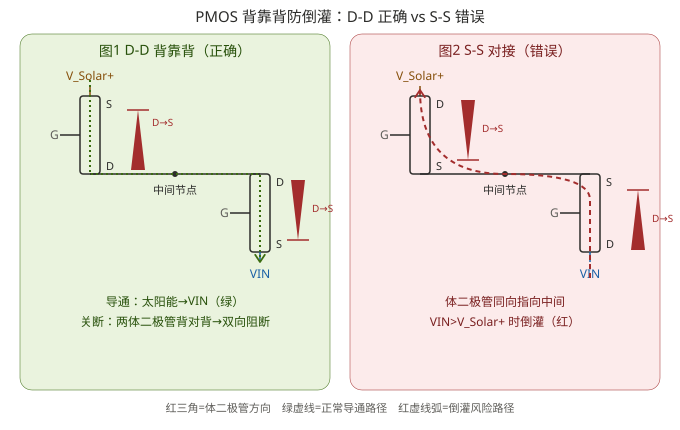

# PMOS 背靠背防倒灌：原理与常见错误

背靠背（back-to-back）PMOS 是实现**双向防倒灌**最经典的分立方案。它看起来只是「两颗 MOS 串一起」，但差一个引脚顺序，结果就是「能用」和「投产即翻车」的天壤之别。本篇把底层机理和最容易画错的那一笔一次讲清。

> 一句话：**双向堵死必须漏极对漏极（D-D）；源极对源极（S-S）是错误的，VIN 高于输入时会倒灌。**



---

## 一、先认清器件：SI2301A 这类 P-MOS

以 SI2301A（SOT-23）为例，引脚与体二极管是固定的：

- 引脚：`1 = G（栅极）`，`2 = S（源极）`，`3 = D（漏极）`
- 内部**体二极管（body diode）固定方向：`D(3) → S(2)`**（阳极在漏极，阴极在源极）
- 也就是说，体二极管**允许电流从漏极流向源极**，反向则截止。

> 为什么是 D→S？P-MOS 的衬底（N 型）接源极，漏/源都是 P 型阱，PN 结方向天然是「漏极正向、源极反向」。这是硅工艺决定的，**画图时无法通过交换引脚改变**，只能靠外部拓扑利用它。

配套基础：[基本元器件-场效应管](../基础知识/基本元器件-场效应管.md)。

---

## 二、为什么单颗 MOS 不够「双向」

一颗 P-MOS 放在高边（源极接输入、漏极接输出）：

- 导通时：沟道双向导通，电流正常从输入→输出。
- 关断时：**体二极管是 D→S，即输出→输入方向**被它反向截止，所以输出无法倒灌回输入。

看，单颗已经能挡住「输出往输入倒灌」这一个方向。但如果你还需要挡住「输入往输出倒灌」（比如两个电源互相别串电），单颗就不够了——它的体二极管在另一方向是正偏的。

所以要**双向都堵**，得用两颗，让两个体二极管**互相把对方的反向通道堵上**。这就是背靠背。

---

## 三、正确拓扑：D-D 背靠背（漏极对接）

```
V_Solar+ ──[Q1.S]   [Q1.D]──┐
                            ├── 中间节点
VIN      ──[Q2.S]   [Q2.D]──┘
```

- Q1：`S` 接输入 `V_Solar+`，`D` 接中间节点
- Q2：`D` 接中间节点，`S` 接输出 `VIN`
- 两管**漏极（D）在中间汇合**

两个体二极管方向都是 `D → S`，于是：

- Q1 体二极管：中间节点 → `V_Solar+`
- Q2 体二极管：中间节点 → `VIN`

**两个箭头都「向外」、背对背地指向各自的源极**。这正是它能双向阻断的关键。

### 关断状态推演

假设两管栅极被拉高，均已关断：

| 想倒灌的方向 | 路径 | 结果 |
|---|---|---|
| `V_Solar+` → `VIN` | 先过 Q1 体二极管（中间→V_Solar+，反向截止） | 第一关就被 Q1 堵死 |
| `VIN` → `V_Solar+` | 先过 Q2 体二极管（中间→VIN，反向截止） | 第一关就被 Q2 堵死 |

无论哪边电压高，总有一只体二极管先反向截止，**双向都过不去**。导通时两管沟道并联，压降仅约 `2 × Rds(on)`，很小。

---

## 四、错误拓扑：S-S 对接（源极对接）

```
V_Solar+ ──[Q1.D]   [Q1.S]──┐
                            ├── 中间节点（这里是「源极」汇合）
VIN      ──[Q2.D]   [Q2.S]──┘
```

- Q1：`D` 接输入 `V_Solar+`，`S` 接中间节点
- Q2：`S` 接中间节点，`D` 接输出 `VIN`
- 两管**源极（S）在中间汇合**

体二极管方向仍是 `D → S`，于是：

- Q1 体二极管：`V_Solar+` → 中间节点
- Q2 体二极管：`VIN` → 中间节点

**两个箭头都「向内」、对向地指向中间节点**。这就是灾难的源头。

### 致命场景：不是「太阳能上电」，而是「VIN 被抬高」

> 网上常见说法：「USB 拔掉、太阳能上电瞬间，电流从 V_Solar+ 经 Q1 体二极管、再经 Q2 体二极管到 VOUT」。
> **这一步其实不成立**——Q2 体二极管是 `VIN→中间`，不是中间→VIN，太阳能那侧的电过不了 Q2 的体二极管。

真正要命的是 **VIN 高于 V_Solar+** 时的倒灌：

1. USB 在位、栅极应被拉高关断两管；
2. 但 `VIN`（电池/负载端，或被外部抬升）电压 **>** `V_Solar+`；
3. Q2 的体二极管 `VIN → 中间` 先导通，把**中间节点**拉到 `VIN − Vf`；
4. 此时 Q1 的 `VGS = 栅极(≈VBUS) − 中间(≈VIN)`，变负；当 `|VGS| > |Vth|` 时 Q1 误导通；
5. 倒灌通路闭合：**`VIN → Q2 体二极管 → 中间 → Q1 沟道 → V_Solar+`**。

> 本质：背靠背要「堵双向」，必须让两只体二极管**背对背**；源极对接让它们**对向**，等于给高压侧开了一扇永远朝中间开的门。错误接法不是「完全不能工作」，而是**在高压侧倒灌这个方向上彻底失效**——而且往往是量产/现场才暴露。

---

## 五、30 秒自检法

拿到一张背靠背原理图，按这个顺序三连问：

1. **中间公共节点接的是哪只脚？**
   - 两管都接**漏极（D）** → ✅ 正确（D-D 背靠背）
   - 两管都接**源极（S）** → ❌ 错误（S-S 对接）
2. **体二极管箭头指向哪？**
   - 两箭头**朝外、背对背** → ✅
   - 两箭头**朝内、对向汇于中间** → ❌
3. **关断时栅极拉到多高？**
   - 能拉到 ≥ 最高源极电压（`V_Solar+`/`VIN` 中较大者）→ ✅
   - 只拉到 3.3V 而源极有 5.5V → ⚠️ 关不断（拓扑对也白搭，见实战篇栅极驱动）

---

## 六、怎么改

- **最小改动**：把两颗 MOS 的源/漏对调，使中间公共节点变成漏极，两端分别接输入与输出（恢复 D-D）。
- **顺手修栅极**：把关断时的栅极高电平目标改成 `V_Solar+` 侧（开漏 + 高边上拉），别依赖 MCU 的 3.3V。
- **要更稳**：换理想二极管控制器（自动驱动栅极、μs 级反向关断）。

---

## 七、一句话记忆

> **背靠背堵双向，漏极必须中间见；源极见面朝里，高压倒灌跑不了。**

落到具体电路（含栅极怎么驱动、元件怎么选）：[实战：SI2301A 切换与栅极驱动](实战-SI2301A切换与栅极驱动.md)。
