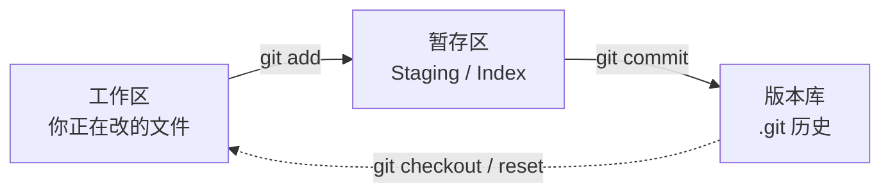
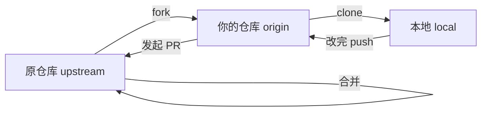

# Git 从入门到协同实战

> 一篇给「小白」的 Git 实战手册：从 *Git 是什么* 讲起，一路走到 *和别人一起改同一个仓库*。
> 文中命令全部基于 **Windows（Git Bash）**，核心案例就是我们刚把知识库推上 GitHub Pages 的真实过程——你正踩过的坑，直接写进了第 10 节。

## 0. 一句话建立直觉

**Git = 给你的文件拍「快照」的时间机器 + 多人协作的合并器。**

- 每次你「提交（commit）」，Git 就把当前所有文件的样子存成一张快照。
- 想回到三天前？切回去即可，文件原样还原。
- 多人同时改？Git 把各自的快照按时间线合并，冲突了再人工裁决。

不用背定义，先记住：**Git 管的是「变化的历史」，不是某个瞬间的文件本身。**

## 1. 为什么要学 Git

| 痛点 | Git 怎么救你 |
|------|--------------|
| 改崩了想反悔 | 任意 commit 都能回退 |
| 怕误删重要文件 | 历史里永远留着 |
| 和同事改同一个项目 | 各改各的，最后合并 |
| 想托管 / 部署到网上 | GitHub + Pages 一行命令上线 |

> 就算你一个人用，Git 也值——它比「复制文件夹 backup_2026_final_final2」靠谱一万倍。

## 2. 三个必须先懂的概念

### 2.1 仓库（Repository）

一个被 Git 接管的文件夹。里面会多出一个隐藏的 `.git/` 目录，所有历史都藏在里头。**你日常编辑的是普通文件，Git 在后台默默记录。**

### 2.2 提交（Commit）

一次「存档」。它包含：

- 这一刻所有文件的快照
- 谁、什么时候、为什么改（提交信息）

每个 commit 有一个由哈希算出的唯一 ID（如 `0fac746`），可以靠它精确定位。

### 2.3 三区模型（新手 80% 的困惑来源）



- **工作区（Working Directory）**：你直接编辑的文件。
- **暂存区（Staging Area / Index）**：「下次提交要包含哪些改动」的暂存清单。`git add` 就是把工作区的改动「端上桌」。
- **版本库（Repository）**：`git commit` 把暂存区的内容正式拍成快照存进 `.git`。

> 关键认知：`git add` 不等于保存，**`git commit` 才是真正存档**。只 add 不 commit，断电就白忙。

## 3. 安装与首次配置

1. 下载安装 [Git for Windows](https://git-scm.com/download/win)，全程默认下一步即可（会带一个 Git Bash 终端）。
2. 装完**第一次必须配置身份**，否则无法提交：

```bash
git config --global user.name  "你的名字"
git config --global user.email "you@example.com"
```

> 为什么？每次 commit 都要「签名」是谁干的。`--global` 表示对这台电脑所有仓库生效；只想对某仓库生效，进到仓库目录去掉 `--global` 再跑一次即可。

验证：

```bash
git config --global user.name
git config --global user.email
```

## 4. 单人本地工作流（你 90% 的时间在做这些）

### 4.1 新建仓库

```bash
cd D:\WorkSpace\Note\wiki      # 进到你的项目目录
git init                        # 把它变成 Git 仓库（生成 .git）
```

### 4.2 日常四件套

```bash
git status                      # 看现在改了啥、哪些还没进暂存区
git add 文件名.md               # 把某个文件加入暂存区
git add -A                      # 把所有改动（新增/修改/删除）加入暂存区
git commit -m "写一句人话说明这次改了啥"   # 正式存档
```

### 4.3 查看历史与差异

```bash
git log --oneline               # 紧凑看提交历史（一行一个）
git log --oneline -5            # 只看最近 5 条
git diff                        # 工作区 vs 暂存区 的差别
git diff --staged               # 暂存区 vs 上一次 commit 的差别
```

> 习惯：写代码前 `git status` 看一眼，提交前 `git diff` 看一眼，能避开绝大多数低级错误。

### 4.4 一个最小实战循环

```bash
# 你新建了 hello.md 并写了内容
git add hello.md
git commit -m "新增 hello.md 入门示例"
git log --oneline               # 看到刚才那条提交
```

## 5. 分支：Git 的灵魂

### 5.1 分支是什么

一句话：**分支就是一个会移动的「指针」，指向某一次 commit。**

默认分支传统叫 `master`，现在 GitHub 新建仓库默认叫 `main`。你所有的 commit 都挂在这条线的节点上，分支指针随新提交自动往前移。

### 5.2 基本操作

```bash
git branch                     # 列出所有本地分支（当前分支前有 *）
git branch dev                 # 新建一个名为 dev 的分支（不切换）
git switch dev                 # 切到 dev 分支（Git 2.23+ 推荐）
git switch -c dev              # 等价于「新建并切换」一步到位
git switch main                # 回到 main
git branch -d dev              # 删掉已合并的 dev 分支
```

> `git switch` 比老的 `git checkout` 语义清晰太多，新手直接用 `switch` 就行。

### 5.3 ⚠️ 重点盲区：`git branch -M main` 是「改名」不是「新建」

这是我（助手）上一轮操作时你踩到的认知坑，单独拎出来讲：

```bash
git branch -M main
```

- 这里的 `-m`（小写）/` -M`（大写）意思是 **rename（重命名）当前分支**。
- `-M` 是大写，表示「强制重命名」（即使目标分支已存在也覆盖）；`-m` 若目标已存在会报错。
- 所以这条命令**不是新建一个 `main` 分支**，而是把当前所在的 `master` 分支**直接改名为 `main`**——旧的 `master` 名字就此消失，它只是换了个名字，历史提交一条没丢。

为什么我们要这么干？因为：

1. GitHub 现在新建仓库的**默认分支是 `main`**（不再是老习惯的 `master`）。
2. 我们仓库里的自动部署流程（`.github/workflows/ci.yml`）监听的是 `main` 分支。
3. 为了让「本地分支名」和「GitHub 默认分支名」对齐，推送时不用额外映射，最省事的做法就是把本地 `master` 改名成 `main`。

> ✅ 记忆口诀：**`git branch -M 新名` = 给当前分支换名字；`git branch 新名` = 新建一个分支（不切换）。** 多一个 `-M`/`-m`，意思天差地别。

### 5.4 合并分支

```bash
git switch main                # 先回到要合并进来的目标分支
git merge dev                  # 把 dev 的改动合并进当前（main）
```

合并可能在两个分支改了同一处时发生**冲突**（见第 8 节）。

## 6. 远程仓库与同步

本地仓库是「单机版」，远程仓库（GitHub/GitLab）是「云端版」，两边要同步。

### 6.1 克隆（从云端拉到本地）

```bash
git clone https://github.com/wild-civil/civil_wiki.git
```

> 克隆下来的仓库**已经自动绑定了远程**，名字默认叫 `origin`，不用再 `remote add`。

### 6.2 绑定远程（本地已有仓库时）

```bash
git remote add origin https://github.com/wild-civil/civil_wiki.git
git remote -v                  # 查看已配置的远程地址
```

> 如果 `origin` 已经存在、想改地址：`git remote set-url origin <新地址>`。重跑 `git remote add origin` 会报错 "origin already exists"。

### 6.3 推送（本地 → 云端）

```bash
git push -u origin main
```

- `origin`：远程的名字。
- `main`：要推的本地分支。
- `-u`（= `--set-upstream`）：建立「跟踪关系」，以后在这个分支直接敲 `git push` / `git pull` 就行，不用每次写 `origin main`。**只需第一次加 `-u`**。

### 6.4 拉取（云端 → 本地）

```bash
git pull                       # = git fetch（取回云端更新）+ git merge（合并到本地）
git fetch                      # 只取回更新，不自动合并，让你先看看再决定
```

> 黄金习惯：**推送前先 `git pull` 一次**，避免你和云端有分叉导致 push 被拒。

## 7. 实战协同：和别人一起改

### 7.1 中心式（小团队 / 自己多设备）

所有人共用一个仓库，直接往 `main`（或 `dev`）推：

```bash
git switch -c feature-xxx      # 开个功能分支干活
# ... 改完 commit ...
git switch main
git merge feature-xxx          # 合并回主分支
git push                       # 推到云端
```

### 7.2 Fork + Pull Request 式（开源协作）



标准动作：

```bash
# 1. 在 GitHub 网页上点 Fork，把别人的仓库复刻到自己账号
# 2. 克隆你自己的复刻
git clone https://github.com/你的名/项目.git
# 3. 添加原仓库为 upstream（用来同步上游更新）
git remote add upstream https://github.com/原作者/项目.git
# 4. 开工前先同步上游
git fetch upstream
git merge upstream/main
# 5. 改完推到自己仓库，再去网页发起 Pull Request
git push -u origin 我的分支
```

## 8. 冲突解决（新手最怕，其实不可怕）

**冲突怎么来的**：两个人（或你两个分支）改了同一文件的同一块，Git 不知道听谁的，就停下来让你裁决。

现象：`git merge` / `git pull` 后报错 `CONFLICT (content)`，文件里出现标记：

```text
<<<<<<< HEAD
这是你本地的版本
=======
这是云端 / 另一分支的版本
>>>>>>> main
```

解决步骤：

1. 打开报冲突的文件，找到 `<<<<<<<` / `=======` / `>>>>>>>` 标记。
2. 手动编辑：保留想要的版本，删掉标记行（也可以两边都留，看需求）。
3. 保存后标记为已解决：

   ```bash
   git add 冲突文件.md
   git commit -m "解决与 main 的合并冲突"
   ```

> 现代编辑器（VS Code 等）会给你「采用当前 / 采用传入 / 两边都要」的按钮，点点点就行，不用手改标记。

## 9. `.gitignore`：别把垃圾提交进去

有些东西**绝对不该进版本库**：构建产物、依赖、缓存、密钥。用 `.gitignore` 告诉 Git 忽略它们。

我们知识库真实的 `.gitignore` 片段：

```gitignore
# MkDocs 构建产物
site/

# MkDocs Material 资源缓存
.material/

# Python 缓存
__pycache__/
*.pyc
*.pyo

# 参考文件（仅本地，不入库）
Reference
```

> 已提交的文件想忽略？先 `git rm --cached 文件名` 把它从版本库移除（本地文件还在），再加进 `.gitignore`。

## 10. 真实案例：把知识库推上 GitHub Pages

下面就是我们这个 wiki 仓库刚走过的完整流程，**你接下来要做的也是这几步**：

```bash
# ① 进到仓库目录（远程仓库已在 GitHub 网页建好，名为 civil_wiki）
cd D:\WorkSpace\Note\wiki

# ② 绑定远程（我们上一轮已执行过，你无需重跑；重跑会报 origin 已存在）
git remote add origin https://github.com/wild-civil/civil_wiki.git

# ③ 把本地 master 改名为 main，对齐 GitHub 默认分支（已执行过）
git branch -M main

# ④ 推送！-u 建立跟踪，之后直接 git push 即可
git push -u origin main
```

推送成功后，去 GitHub 仓库：

- `Settings → Pages → Source` 选 **「Deploy from a branch」**
- 分支选 **`gh-pages` / (root)**，保存
- 等 Actions 跑完（约 1–2 分钟），访问 👉 `https://wiki.hanvon.top/`（注：本仓库在 GitHub 设了独立自定义域名 `wiki.hanvon.top`，覆盖了账号用户站点 `blog2.hanvon.top` 的默认继承；DNS 需 CNAME 指向 `wild-civil.github.io`，并随站部署 `docs/CNAME`）

> ⚠️ **隐私坑（必读）**：GitHub Pages 渲染出的网页是**全网公开**的，即使仓库设为私有也一样（私有只藏得住 `.md` 源文件，藏不住渲染页）。`hidden: true` 也只是不进导航，**页面仍可被 URL 直接访问**。真·敏感内容务必物理移出 `docs/` 或发布前打码。

## 11. 高频速查表

| 场景 | 命令 |
|------|------|
| 初始化仓库 | `git init` |
| 克隆远程 | `git clone <url>` |
| 看状态 | `git status` |
| 加入暂存 | `git add -A` |
| 提交 | `git commit -m "说明"` |
| 看历史 | `git log --oneline` |
| 建并切分支 | `git switch -c 分支名` |
| 切分支 | `git switch 分支名` |
| 重命名当前分支 | `git branch -M 新名` |
| 合并分支 | `git merge 分支名` |
| 绑远程 | `git remote add origin <url>` |
| 推（首次建跟踪） | `git push -u origin 分支名` |
| 推（之后） | `git push` |
| 拉（取+合） | `git pull` |
| 仅取回 | `git fetch` |
| 回退到某提交（保留改动） | `git reset --soft <commit>` |
| 丢弃某文件改动 | `git checkout -- 文件名` |

## 12. 新手避坑清单

- ✅ **提交信息写人话**：`fix: 修复导航校验脚本路径错误` 远比 `update` 有用。
- ✅ **推送前先 `git pull`**，减少分叉冲突。
- ✅ **别在 `main` 上直接乱改大功能**，开个分支再 merge。
- ✅ **敏感文件（密钥、隐私）进 `.gitignore` 或打码**，别指望 `hidden` 能藏网页。
- ⚠️ **`git branch -M main` 是改名不是新建**——别以为它凭空多了个 `main` 分支。
- ⚠️ **只 `add` 不 `commit` 不算存档**，断电即丢。
- ⚠️ **`git reset --hard` 会丢弃工作区改动**，用前确认。

---

> 这篇文章本身也是我们知识库「博客改造」系列之外的一份独立教程。后续你如果再踩到新的 Git 坑，直接在这篇里补一节即可。
