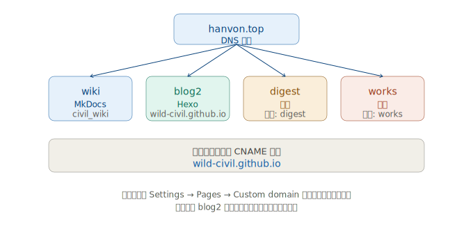

# 域名规划与部署

把知识库、博客、书摘、作品四个站点统一收在自己的域名 `hanvon.top` 下，各用独立子域名。本文记录映射关系、GitHub Pages 的自定义域名机制，以及落地步骤。

## 站点映射总览

| 子域名 | 对应仓库 | 生成器 | 类型 | 状态 |
| --- | --- | --- | --- | --- |
| `wiki.hanvon.top` | `wild-civil/civil_wiki` | MkDocs Material | 项目页 | 已配（代码侧就绪） |
| `blog2.hanvon.top` | `wild-civil.github.io` | Hexo | 用户站点 | 已上线 ✅ |
| `nav.hanvon.top` | `wild-civil/civil_nav` | MkDocs Material | 项目页 | 已建脚手架 |
| `digest.hanvon.top` | `wild-civil/civil_digest` | MkDocs Material | 项目页 | 已建脚手架 |
| `works.hanvon.top` | `wild-civil/civil_works` | MkDocs Material | 项目页 | 已建脚手架 |

> 用户站点仓库必须命名为 `<用户名>.github.io`（即 `wild-civil.github.io`），它承载博客并绑定 `blog2.hanvon.top`。其余都是普通项目仓库，走 `<用户名>.github.io/<仓库名>` 的底层路径，但设置自定义域名后对外只暴露子域名。

## 核心机制：每个仓库可独立设自定义域名

GitHub 的默认规则是：**给用户/组织站点设了自定义域名后，账号下所有项目页默认继承同一个域名**（即 `blog2.hanvon.top/civil_wiki/`）。但官方明确支持覆盖：

> *You can override the default custom domain by adding a custom domain to the individual repository.*

所以每个项目仓库在 `Settings → Pages → Custom domain` 里填自己的子域名即可，互不影响。

### DNS 配置

每个子域名在域名服务商加一条 **CNAME 记录**，值统一为 `wild-civil.github.io`：

| 主机记录 | 记录类型 | 记录值 |
| --- | --- | --- |
| `wiki` | CNAME | `wild-civil.github.io` |
| `blog2` | CNAME | `wild-civil.github.io` |
| `digest` | CNAME | `wild-civil.github.io` |
| `works` | CNAME | `wild-civil.github.io` |

GitHub 对每个自定义子域名**免费提供 HTTPS 证书**（账号免费计划即可，无需升级 Pro）。

## ⚠️ 致命坑：`gh-deploy` 会清掉自定义域名

`mkdocs gh-deploy --force`（或 Hexo 的 deploy）会**整个覆盖 `gh-pages` 分支**。而 GitHub 在你网页设置里填自定义域名时，是往 `gh-pages` 根目录放一个 `CNAME` 文件来记住域名的——`gh-deploy --force` 一覆盖，这个 `CNAME` 就没了，结果：

- 自定义域名被重置回 `wild-civil.github.io/...`
- HTTPS 证书随之失效，访问报不安全

**根治办法：把 `CNAME` 文件放进源码，随站点一起部署。** 这样构建产物里自带 `CNAME`，`gh-deploy` 覆盖后它依然在。

| 生成器 | 放哪里 | 内容 |
| --- | --- | --- |
| MkDocs | `docs/CNAME` | 一行 `wiki.hanvon.top` |
| Hexo | `source/CNAME` | 一行 `blog2.hanvon.top` |
| 其他静态站 | 站点根目录输出 `CNAME` | 对应子域名 |

> `civil_wiki` 已在 `docs/CNAME` 写入 `wiki.hanvon.top`，构建后会出现在 `site/CNAME`，随 `gh-deploy` 一起上 `gh-pages`。

## 落地步骤

### 1. 知识库 `wiki.hanvon.top`（代码侧已完成）

代码侧已就绪，你只需在控制台操作：

1. DNS 加 `wiki` CNAME → `wild-civil.github.io`
2. 进 `civil_wiki` 仓库 `Settings → Pages → Custom domain` 填 `wiki.hanvon.top`，等证书签发后勾 `Enforce HTTPS`
3. 已配置的项：
   - `mkdocs.yml`：`site_url: https://wiki.hanvon.top/`
   - `docs/CNAME`：`wiki.hanvon.top`
   - CI（`.github/workflows/ci.yml`）：`permissions: contents: write`（够了）

### 2. 博客 `blog2.hanvon.top`（已完成）

`wild-civil.github.io` 仓库已绑定 `blog2.hanvon.top`，`source/CNAME` 随 Hexo 部署。保持即可。

### 3. 导航 `nav.hanvon.top`（已建脚手架）

本地仓库 `D:\WorkSpace\Note\wild-civil\civil_nav`，已用 MkDocs Material 建好 grid cards 总导航页。上线步骤同 wiki：推到 GitHub 新建仓库 `civil_nav` → DNS 加 `nav` CNAME → `Settings → Pages → Custom domain` 填 `nav.hanvon.top`。

### 4. 书摘 `digest.hanvon.top`（已建脚手架）

本地仓库 `D:\WorkSpace\Note\wild-civil\civil_digest`，MkDocs Material 脚手架已就绪（`docs/CNAME` 已写 `digest.hanvon.top`）。上线步骤：推到 GitHub 新建仓库 `civil_digest` → DNS 加 `digest` CNAME → `Settings → Pages → Custom domain` 填 `digest.hanvon.top`。

### 5. 作品 `works.hanvon.top`（已建脚手架）

同书摘，本地仓库 `D:\WorkSpace\Note\wild-civil\civil_works`，子域名 `works.hanvon.top`，`docs/CNAME` 已就位。

## 验证清单

- [ ] 每个子域名 DNS CNAME 已生效（`dig wiki.hanvon.top` 应返回 `wild-civil.github.io`）
- [ ] 各仓库 `Settings → Pages → Custom domain` 显示域名且打勾 `Enforce HTTPS`
- [ ] 访问各子域名均走 HTTPS、内容正常
- [ ] 重新部署后域名不丢（验证 `gh-deploy` 后 `CNAME` 仍在 `gh-pages` 根目录）

## 相关文档

- 《Git 从入门到协同实战》第 10 节：推上 GitHub Pages 的真实流程
- 《博客改造日志》：本站历次改造记录
